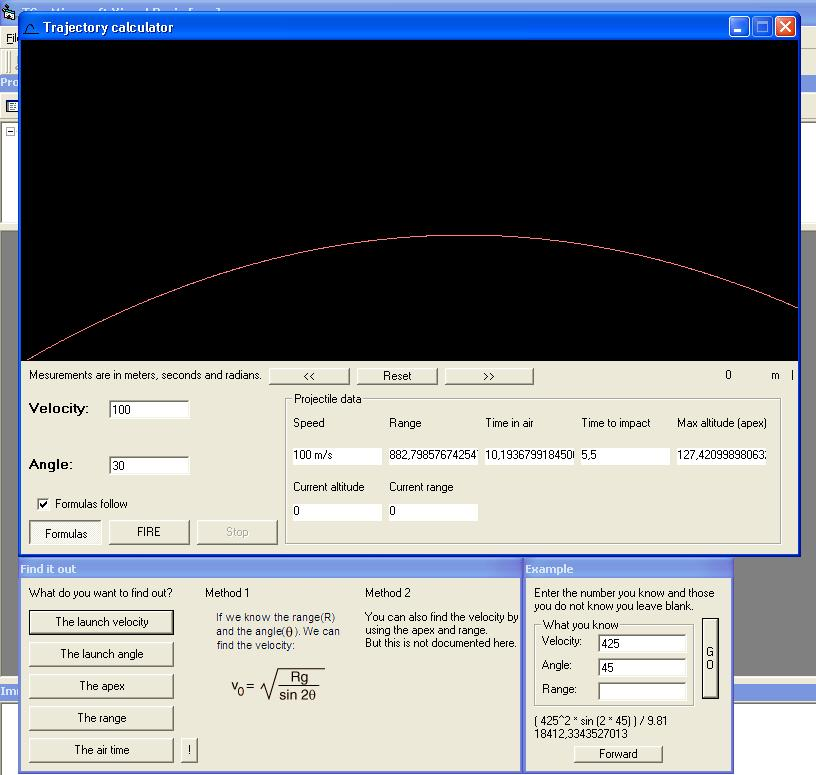



## Trajectory calculator

### Description

Calculate trajectories. Common problems can be solved using this app as well..like what must my angle be if i want to shoot a projectile a 100 m?
 
### More Info
 

             |
---                |---
**Submitted On**   |2003-07-09 19:10:26
**By**             |[Taltan](https://github.com/Planet-Source-Code/PSCIndex/blob/master/ByAuthor/taltan.md)
**Level**          |Intermediate
**User Rating**    |5.0 (10 globes from 2 users)
**Compatibility**  |VB 6\.0
**Category**       |[Math/ Dates](https://github.com/Planet-Source-Code/PSCIndex/blob/master/ByCategory/math-dates__1-37.md)
**World**          |[Visual Basic](https://github.com/Planet-Source-Code/PSCIndex/blob/master/ByWorld/visual-basic.md)
**Archive File**   |[Trajectory1613647132003\.zip](https://github.com/Planet-Source-Code/taltan-trajectory-calculator__1-46861/archive/master.zip)

